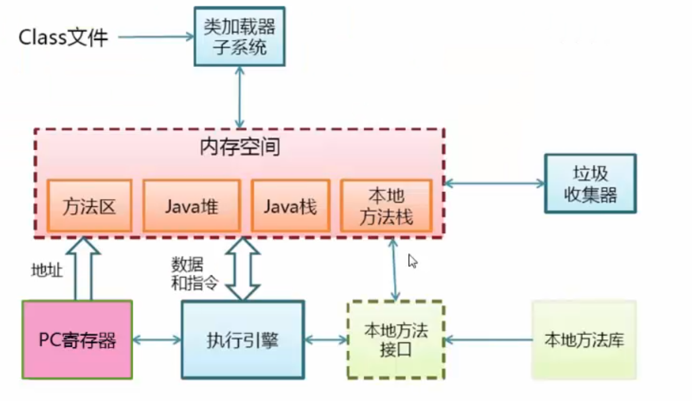

# JVM学习

[TOC]

### JVM运行机制

#### jvm启动


#### jvm基本结构



##### pc寄存区

- 每一个线程拥有一个pc寄存器
- 在线程创建时创建
- 指向下一条指令的地址
- 执行本地方法时，PC的值为undefined

##### 方法区（永久代）

- 保存装载的类信息
  - 类的常量池
  - 字段，方法信息
  - 方法字节码
- 通常和**<u>永久区</u>**在一起
- jdk6时，String等常量信息置于方法区，7移动到了堆中
- 永久代（perm）解释：方法区常被称为永久代，实际上两者并不等价。仅仅是因为hotspot虚拟机将gc分代手机扩展至了方法区。在其他虚拟机中不存在此概念。主要gc常量。jdk7已经把常量移到了堆中，jdk8完全抛弃了永久代，改为元空间（metaspace）。类的元信息被存储在元空间中。元空间没有使用堆内存，而是与堆不相连的本地内存区域。
- jdk8方法区移至Metaspace，字符串常量移至Java Heap

##### java堆

- 和程序开发密切相关
- 应用程序的对象都在java堆中
- 所有的线程共享java堆
- 对分代gc来说，堆也是分代的
- gc主要工作空间是堆


##### java栈（帧栈）

- 线程私有
- 栈由一系列帧组成（所以java栈也叫做**<u>帧栈</u>**）
- 帧中保存着一个方法的**<u>局部变量</u>，<u>操作数栈</u>，<u>常量池指针</u>**
- 每一次方法调用创建一个帧，并压栈


##### java栈-栈上分配

- 小对象（一般几十个bytes），在没有**逃逸**的情况下，可以直接分配在栈上
- 直接分配在栈上，可以自动回收，减轻gc压力
- 大对象或者**逃逸**对象无法分配在栈上


#### 内存模型

- 每一个线程有一个工作内存和**主存**(线程默认不从主存中读取，从自己的工作内存中读)
- 工作内存存放主存中变量的值得拷贝
- volatile关键字可以强制从主存中读取

##### 内存可见性

- 一个线程修改了变量，其他线程可以立即知道

##### 保证可见性的方法

- volatile
- synchronized（unlock之前，写变量值会主存）
- final (一旦初始化完成，其他线程就可见)

##### 有序性

- 在本线程中，操作都是有序的
- 在线程外观察，操作都是无序的。（**指令重排** 或 **主存同步延时**）

##### 指令重排

- 线程内串行语义
  - 写后读           a = 1; b = a;
  - 写后写           a = 1; a = 2;
  - 读后写           a = b; b = 1;
  - 以上语句不可重排
  - 编译器不会考虑多线程之间的语义
  - 可重排: a = 1; b = 1;

##### 指令重排的基本原则

- 顺序原则：**一个线程内**语义的串行性（不能因为指令重拍破坏结果）
- volatile规则：volatile变量的写，先发生于读
- 锁规则：**解锁**（unlock）必然发生于在随后的**加锁**（lock）前
- 传递性：A优先于B，B优先于C，那么A必优先于C
- 线程的start方法先于它的没一个动作
- 线程所有的操作先于线程的终结（Thread.join()）
- 线程的中断（interrupt()）先于被中断线程的代码
- 对象的构造函数执行结束于finalize()方法


#### 编译和解释执行的概念

##### 解释执行

- 解释执行以解释方式运行字节码
- 读一句执行语句

##### 编译执行

- 将字节码编译成机器码
- 直接执行机器码
- 运行时编译
- 编译后性能有数量级的提升

### 常用jvm配参数

#### Trace跟踪参数

##### -verbose:gc 或 -XX:+printGC 可以打印GC简要的信息

	[GC (Allocation Failure)  65536K->1000K(251392K), 0.0023425 secs]

##### -XX:+PrintGCDetails

- 打印GC详细信息

##### -XX:+PrintGCTimeStamps（垃圾回收介绍）

- 打印GC发生的时间戳

```
//GC前没有Full，说明是一个Minor GC
//Allocation Failure:gc原因是因为年轻带中没有足够的空间进行存储了
//PSYoungGen:垃圾收集器
12.712: [GC (Allocation Failure) [PSYoungGen: 97344K->64K(95232K)] 98600K->1320K(270336K), 0.0012635 secs] [Times: user=0.01 sys=0.00, real=0.00 secs] 
Heap
 PSYoungGen      total 95232K, used 59738K [0x000000076ab00000, 0x000000077a180000, 0x00000007c0000000)
 //新生代 一共95232K，使用59738K
 
  eden space 94720K, 63% used [0x000000076ab00000,0x000000076e546958,0x0000000770780000)
//其中eden区(对象出生的地方，用了百分之63)  
  
  from space 512K, 12% used [0x000000077a100000,0x000000077a110000,0x000000077a180000)
  to   space 512K, 0% used [0x000000077a080000,0x000000077a080000,0x000000077a100000)
//from 和 to 新生代，后面会做介绍 
 
 ParOldGen       total 175104K, used 1256K [0x00000006c0000000, 0x00000006cab00000, 0x000000076ab00000)
//老生带 

  object space 175104K, 0% used [0x00000006c0000000,0x00000006c013a3c0,0x00000006cab00000)
  
  
 Metaspace       used 3925K, capacity 4568K, committed 4864K, reserved 1056768K
 
 
  class space    used 436K, capacity 460K, committed 512K, reserved 1048576K
```


#### 堆的分配参数

#### 栈的分配参数

#### 


###  jvm 内存模型

### 什么是内存模型

我曾经在《[再有人问你Java内存模型是什么，就把这篇文章发给他](https://link.juejin.im?target=https%3A%2F%2Fwww.hollischuang.com%2Farchives%2F2550)》中详细的介绍过Java内存模型的来龙去脉，这里再重新回顾一下。

Java内存模型是根据英文Java Memory Model（JMM）翻译过来的。其实JMM并不像JVM内存结构一样是真实存在的。他只是一个抽象的概念。

Java内存模型的相关知识在 JSR-133: Java Memory Model and Thread Specification 中描述的。JMM是和多线程相关的，他描述了一组规则或规范，这个规范定义了一个线程对共享变量的写入时对另一个线程是可见的。

**Java内存模型（Java Memory Model ,JMM）就是一种符合内存模型规范的，屏蔽了各种硬件和操作系统的访问差异的，保证了Java程序在各种平台下对内存的访问都能得到一致效果的机制及规范。目的是解决由于多线程通过共享内存进行通信时，存在的原子性、可见性（缓存一致性）以及有序性问题。**

那么，我们这里就先来说说什么是所谓的内存模型规范、这里提到的原子性、可见性以及有序性又是什么东西？

**原子性**

线程是CPU调度的基本单位。CPU有时间片的概念，会根据不同的调度算法进行线程调度。所以在多线程场景下，就会发生原子性问题。因为线程在执行一个读改写操作时，在执行完读改之后，时间片耗完，就会被要求放弃CPU，并等待重新调度。这种情况下，读改写就不是一个原子操作。即存在原子性问题。

**缓存一致性**

在多核CPU，多线程的场景中，每个核都至少有一个L1 缓存。多个线程访问进程中的某个共享内存，且这多个线程分别在不同的核心上执行，则每个核心都会在各自的caehe中保留一份共享内存的缓冲。由于多核是可以并行的，可能会出现多个线程同时写各自的缓存的情况，而各自的cache之间的数据就有可能不同。

在CPU和主存之间增加缓存，在多线程场景下就可能存在缓存一致性问题，也就是说，在多核CPU中，每个核的自己的缓存中，关于同一个数据的缓存内容可能不一致。

**有序性**

除了引入了时间片以外，由于处理器优化和指令重排等，CPU还可能对输入代码进行乱序执行，比如load->add->save 有可能被优化成load->save->add 。这就是有序性问题。

多CPU多级缓存导致的一致性问题、CPU时间片机制导致的原子性问题、以及处理器优化和指令重排导致的有序性问题等，都硬件的不断升级导致的。那么，有没有什么机制可以很好的解决上面的这些问题呢？

最简单直接的做法就是废除处理器和处理器的优化技术、废除CPU缓存，让CPU直接和主存交互。但是，这么做虽然可以保证多线程下的并发问题。但是，这就有点因噎废食了。

所以，为了保证并发编程中可以满足原子性、可见性及有序性。有一个重要的概念，那就是——**内存模型**。

为了保证共享内存的正确性（可见性、有序性、原子性），内存模型定义了共享内存系统中多线程程序读写操作行为的规范。通过这些规则来规范对内存的读写操作，从而保证指令执行的正确性。它与处理器有关、与缓存有关、与并发有关、与编译器也有关。他解决了CPU多级缓存、处理器优化、指令重排等导致的内存访问问题，保证了并发场景下的一致性、原子性和有序性。

针对上面的这些问题，不同的操作系统都有不同的解决方案，而Java语言为了屏蔽掉底层的差异，定义了一套属于Java语言的内存模型规范，即Java内存模型。

Java内存模型规定了所有的变量都存储在主内存中，每条线程还有自己的工作内存，线程的工作内存中保存了该线程中是用到的变量的主内存副本拷贝，线程对变量的所有操作都必须在工作内存中进行，而不能直接读写主内存。不同的线程之间也无法直接访问对方工作内存中的变量，线程间变量的传递均需要自己的工作内存和主存之间进行数据同步进行。

而JMM就作用于工作内存和主存之间数据同步过程。他规定了如何做数据同步以及什么时候做数据同步。





### Java内存模型的实现

了解Java多线程的朋友都知道，在Java中提供了一系列和并发处理相关的关键字，比如volatile、synchronized、final、concurren包等。其实这些就是Java内存模型封装了底层的实现后提供给程序员使用的一些关键字。

在开发多线程的代码的时候，我们可以直接使用synchronized等关键字来控制并发，从来就不需要关心底层的编译器优化、缓存一致性等问题。所以，Java内存模型，除了定义了一套规范，还提供了一系列原语，封装了底层实现后，供开发者直接使用。

本文并不准备把所有的关键字逐一介绍其用法，因为关于各个关键字的用法，网上有很多资料。读者可以自行学习。本文还有一个重点要介绍的就是，我们前面提到，并发编程要解决原子性、有序性和一致性的问题，我们就再来看下，在Java中，分别使用什么方式来保证。

**原子性**

在Java中，为了保证原子性，提供了两个高级的字节码指令monitorenter和monitorexit。在synchronized的实现原理文章中，介绍过，这两个字节码，在Java中对应的关键字就是synchronized。

因此，在Java中可以使用synchronized来保证方法和代码块内的操作是原子性的。

**可见性**

Java内存模型是通过在变量修改后将新值同步回主内存，在变量读取前从主内存刷新变量值的这种依赖主内存作为传递媒介的方式来实现的。

Java中的volatile关键字提供了一个功能，那就是被其修饰的变量在被修改后可以立即同步到主内存，被其修饰的变量在每次是用之前都从主内存刷新。因此，可以使用volatile来保证多线程操作时变量的可见性。

除了volatile，Java中的synchronized和final两个关键字也可以实现可见性。只不过实现方式不同，这里不再展开了。

**有序性**

在Java中，可以使用synchronized和volatile来保证多线程之间操作的有序性。实现方式有所区别：

volatile关键字会禁止指令重排。synchronized关键字保证同一时刻只允许一条线程操作。

好了，这里简单的介绍完了Java并发编程中解决原子性、可见性以及有序性可以使用的关键字。读者可能发现了，好像synchronized关键字是万能的，他可以同时满足以上三种特性，这其实也是很多人滥用synchronized的原因。

但是synchronized是比较影响性能的，虽然编译器提供了很多锁优化技术，但是也不建议过度使用。

### 面试如何回答

前面我介绍完了一些和Java内存模型有关的基础知识，只是基础，并不是全部，因为随便一个知识点还是都可以展开的，如volatile是如何实现可见性的？synchronized是如何实现有序性的？

但是，当面试官问你：能简单介绍下你理解的内存模型吗？

首先，先和面试官确认一下：您说的内存模型指的是JMM，也就是和并发编程有关的那一个吧？

在得到肯定答复后，再开始介绍（如果不是，那可能就要回答堆、栈、方法区哪些了....囧...）：

Java内存模型，其实是保证了Java程序在各种平台下对内存的访问都能够得到一致效果的机制及规范。目的是解决由于多线程通过共享内存进行通信时，存在的原子性、可见性（缓存一致性）以及有序性问题。

除此之外，Java内存模型还提供了一系列原语，封装了底层实现后，供开发者直接使用。如我们常用的一些关键字：synchronized、volatile以及并发包等。

回答到这里就可以了，然后面试官可能会继续追问，然后根据他的追问再继续往下回答即可。

所以，当有人再问你Java内存模型的时候，不要一张嘴就直接回答堆栈、方法区甚至GC了，那样显得很不专业！


