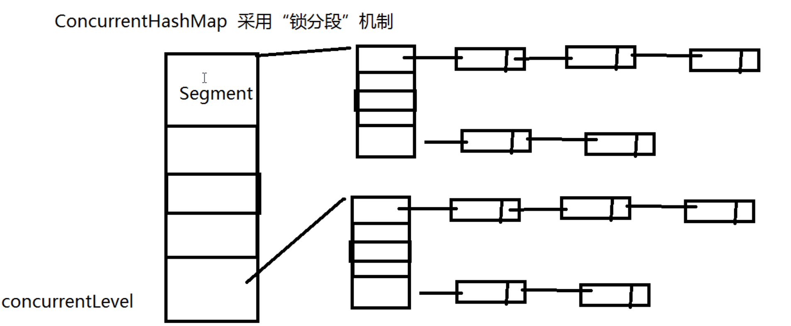
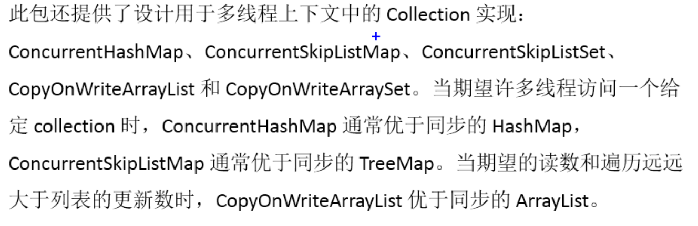

#  java线程学习

> 在java中实现多线程
>
> 1.继承Thread
>
> 2.实现Runnable接口
>
> 3.实现Callable接口

##  继承Thread类

```
public class Foo extends Thread{
	public static void main(String[] args) {
		Thread t = new Foo();
		new Thread(t).start;
	}
	
	@Override
	public void run() {
		System.out.print("hello world");
	}
}
```

##  实现Runnable接口

```
class ThreadDemo implements Runnable {

    private volatile boolean flag ;

    public boolean isFlag() {
        return flag;
    }

    public void run() {
        try {
            Thread.sleep(1000);
        } catch (InterruptedException e) {
            e.printStackTrace();
        }
        flag = true;

        System.out.println("flag = " + flag);
    }
}

```


###  volatile关键字
	可以将各个线程共享内存
	防止指令重排


##  手写CasInteger

> cas算法 ( campare and swap)    原子化比较和替换


```
public class CasInteger {

    private volatile int number;

    public int incr() {
        while (true) {
        		//先拿旧的(预估值)
            int old = number;
            if (cas(old, number + 1)) {
                return newNum;
            }
        }

    }

		//compare and swap
    private synchronized boolean cas(int oldNum, int newNum) {
        if (number == oldNum) {
            number = newNum;
            return true;
        }
        return false;
    }

}
```


##  juc下面的线程安全的集合


###  concurrentHashMap

> 锁分段机制




> java8之后换成cas(操作系统级别基本相当于无所算法)


##  juc其他集合




##  CountDownLatch 闭锁

> 闭锁是一个同步辅助类，在完成一组正在其他线程中执行的操作之前，它允许一个或多个线程等待。

