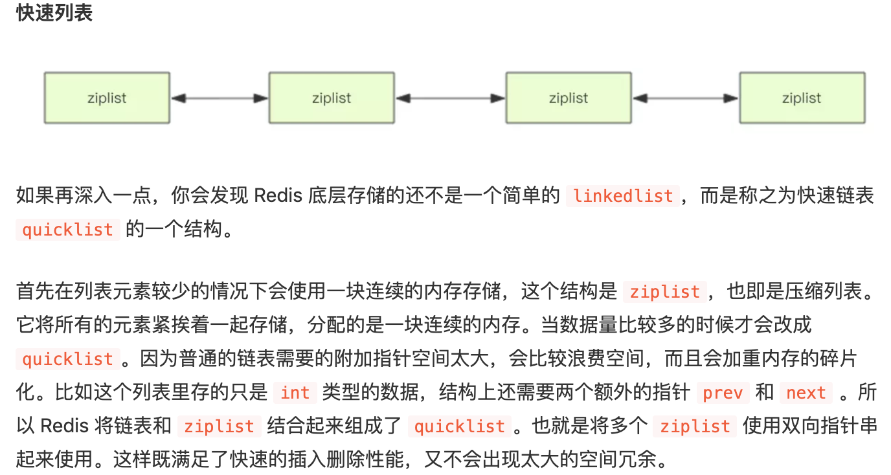

#  Redis学习笔记

[TOC]

##   redis基础数据结构

###   string(字符串)

####  键值对：

	set <key> <value>   
	get <key>
	exist <key> 是否存在key
	del <key>
	getset <key> <value> 获取并重新修改值
	object encoding <key> 存储类型
	append <key> <value> 追加
	getrange <key> <start> <end> 获取从start到end的字符
	setrange <key> <start> <value> 从start开始覆盖

#### 位图bitmap

```
setbit <key> <index> 1 给key的第index位为1
getbit <key> <index> 获取key的第index个字节
bitop <operater> <key> <key> (<key>) 对多个key执行位运算操作<operater>可以是and or xor not
```

####  批量键值对：

	mset <key1> <value1> <key2> <value2> <key3> <value3> ……
	mget <key1> <key2> <key3>
####  过期和set命令设置：

	expire <key> <time> 设置某个key的过期时间
	setex <key> <time> <value> 设置某个key的过去时间(set + expire)
	setnx <key> <value>  如果已经存在则返回0 可做分布式锁

####   计数：

	incr <key> 某个key自增1
	incrby <key> <number> 某个key增加number数量
	incrbyfloat <key> <number> 增加


###  List（列表）

####  右进左出(队列)

	rpush <key> <value> <value> …… 从右边进
	llen <key> 长度
	lpop <key> 从左边弹出一个

####   右进右出(栈)

	rpop <key> 右边弹出

####  慢操作

	lindex <key> <index> 获取下标的value #O(n) 慎用
	lrange <key> 0 -1 获取所有元素 #O(n) 慎用
	ltrim <key> 1 -1 对区间(1，-1)保留，其他删除

####  快速列表




###    hash(字典)

	hset <key> <field> <value>	增加返回1，新增返回0
	hget <key> <field> 获取value
	hgetall <key> 	 # entries()，key 和 value 间隔出现
	hlen <key>	获取key数量
	hincrby <key> <field> <number> 增加number的数量


###   set(集合)

	sadd <key> <value> <value> …… 返回插入成功的数量
	smembers <key> 返回所有的value
	smember <key> <value> 看value是否存在
	scard <key> 查询数量
	spop <key> 随机弹出一个


###  zset(有序集合)

	zadd <key> <source> <value> 原先没有返回1，原先有返回0并更新source
	zrange <key> <start> <end> 按照source正序输出
	zrevrange <key> <start> <end> 按照source倒叙输出
	zcard <key> 查看有多少个key
	zscore <key> <value> 查看某个value的分数
	zrangebyscore <key> <start> <end> 通过score排序
	zrevrangebyscore <key> <start> <end> 
	zrem <key> <value> 删除某个value

### HyperLogLog

> 此数据结构可以非常省内存的统计各种计数,pv,uv等.

```
pfadd <key> <value>(<value>...) 添加
pfcount <key> 统计
pfmerge <key> <已经存在的key> <已经存在的key> (<已经存在的key> ...) 合并HyperLogLog
```


###  过期时间

	ttl <key> 获取时间时间离现在秒数s
	pttl <key> 获取时间时间离现在毫秒数ms


### 查找键

```
keys <patten> 查找key
```

## 持久化

### RDB拍镜像

默认使用的是bgsave会在此目录下创建dump.rdb文件

- 阻塞式

```
save
```

- 非阻塞式

> redis会正常接受客户端的请求，会fork()出一个新的子进程来创建rdb文件，处理完之后会发送信号通知他处理完毕。

```
bgsave
```

### AOF采用追加的方式保存

> 默认文件appendonly.aof。记录所有的写操作命令，在启动是使用这些命令就可以还原数据库。

> 并不能保证绝对不丢失数据。为了提高效率，系统通常不会将内容直接写入硬盘，而是先将内容写入一个内存缓冲区中，等到缓冲区被填满，或者执行fsync调用和fdatasync调用是才能将存储在缓冲区里面的内容写入磁盘，有可能会丢失。


[腾讯云redis文档](https://cloud.tencent.com/developer/doc/1203)：https://cloud.tencent.com/developer/doc/1203


